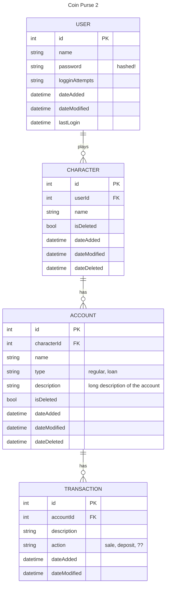

```mermaid

---
title: Coin Purse 2
---
erDiagram
    USER ||--o{ CHARACTER : plays
    USER {
        int id PK
        string name
        string password "hashed!"
        string logginAttempts
        datetime dateAdded
        datetime dateModified
        datetime lastLogin
    }

    CHARACTER ||--o{ ACCOUNT: has
    CHARACTER {
        int id PK
        int userId FK
        string name
        bool isDeleted
        datetime dateAdded
        datetime dateModified
        datetime dateDeleted
    }

    ACCOUNT ||--o{ TRANSACTION: has
    ACCOUNT {
        int id PK
        int characterId FK
        string name
        string type "regular, loan"
        string description "long description of the account"
        bool isDeleted
        datetime dateAdded
        datetime dateModified
        datetime dateDeleted
    }

    TRANSACTION {
        int id PK
        int accountId FK
        string description
        string action "sale, deposit, ??"
        datetime dateAdded
        datetime dateModified
    }
```
